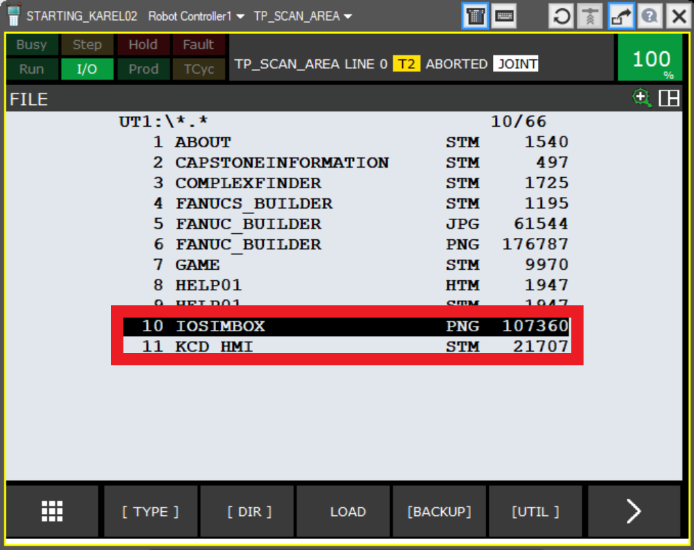
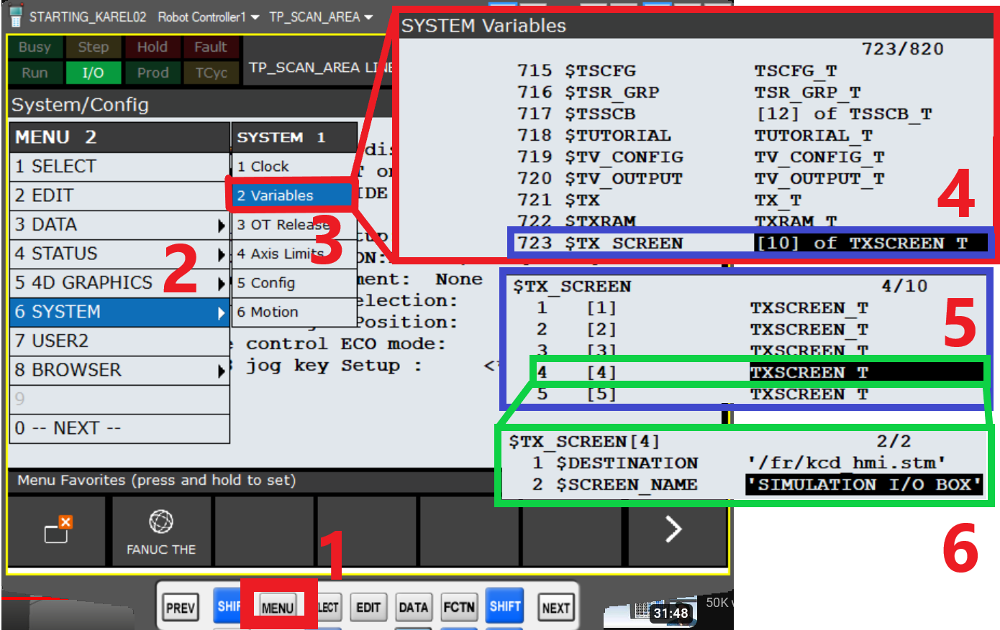
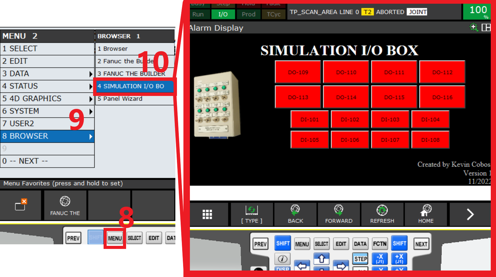
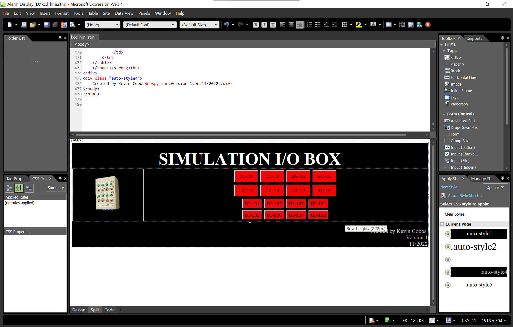

# SIMULATION I/O BOX FOR THE FANUC'S ROBOT

## Table of contents
- [Introduction](#introduction)   
- [Prerequisites](#prerequisites)] 
- [Installation of the HMI project](#installation-of-the-hmi-project)
- [Exploring the new HMI page](#exploring-the-new-hmi-page)
- [Example of HMI being edited](#example-of-hmi-being-edited)
- [Source video](#source-video)
  
## Introduction
  
This project uses Fanuc's HMI SDK includes some objects that allow us to emulates inputs and outputs for a Fanuc robot, making it possible to turn ON a digital output or show a input being ON or OFF, for testing and development purposes.
  
## Prerequisites
  
  Before you begin, ensure you have download and copy the two files to you fr: drive on the robot.
   

  
## Installation of the HMI project
  
1) Click on Button MENU
2) Select option 6 SYSTEM
3) Select option 2 VARIABLES
4) Select option OPTION 723 $TX_SCREEN
5) We are selecting option 4, don't use the option 1, because it is reserved for Fanuc's internal use.
6) Change this values according to your projects values.
7) Go back to the option 5, and select the option 4 to see if the new infornation for the HMI page is there.
  

  
## Exploring the new HMI page
  
8) Click on Button MENU
9) Select option 9 BROWSER
10) Select the option that you created in the step 5. In this case, we are using the option 4. 
  

## Example of HMI being edited
  

## Source video
https://www.youtube.com/watch?v=2eURFLeHW8o&t=705s
